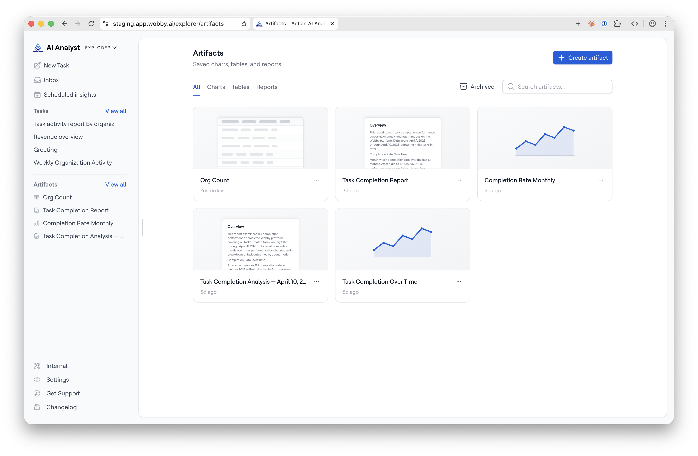
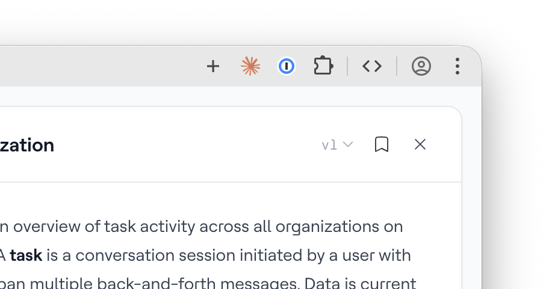

# Artifacts

An **Artifact** is a saved output from a conversation with your AI Analyst — a chart, table, or report that you want to keep. Artifacts live in a dedicated library in Explorer, stay queryable over time, and can be linked back to the conversation that produced them.

## What's an Artifact?

When the AI Analyst produces a chart, table, or report in a conversation, it starts as an **unsaved output** — it's in the chat, but it has no stable identity and can't be found later outside of that conversation. When you save it, it becomes an **Artifact**: it gets a name, a stable ID, and a place in your Explorer library.

There are three types of Artifact:

| Type | What it is |
| ---- | ----------- |
| **Chart** | A visualisation produced by the AI Analyst |
| **Table** | A data table produced by the AI Analyst |
| **Report** | A structured document with headings, paragraphs, charts, and tables — see [Reports](reports.md) |

## Saving Artifacts

You can easily save any report, table, or chart to your artifacts library by clicking the save button in the artfiact sidebar.

## Live data

Artifacts are not snapshots. Every time you open a saved chart, table, or report, the underlying query re-runs against your data source — so you always see current numbers.

A subtle indicator in the artifact view reads: _"Live data — results update on each view."_ This means a chart saved today will show different numbers next month if the underlying data has changed, which is usually what you want.

## Finding Artifacts

### Sidebar

The Explorer sidebar has an **Artifacts** section showing your most recently saved items, each labelled by type (Report, Chart, Table). Click **View all >** to open the full Artifacts page.

### Artifacts page

The Artifacts page lists all your saved Artifacts, newest first. You can:

* **Filter by type** — use the \[All] \[Charts] \[Tables] \[Reports] pills to narrow the list
* **Search by title** — find a specific Artifact by name

Click any Artifact to open it in detail.

## Pinning Artifacts

Star an Artifact from the Artifacts page to pin it to the top of the sidebar section. Pinned Artifacts always appear first, regardless of when they were saved.

See [Reports](reports.md) for more on building and editing reports.
