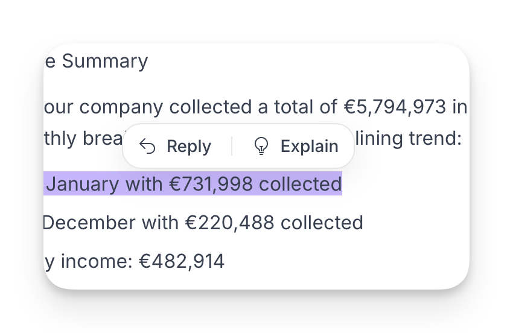
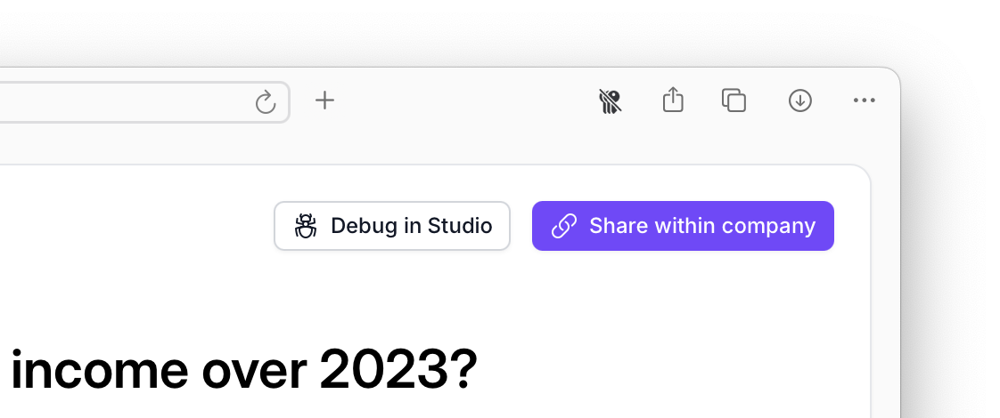

# Asking Questions

## Starting a conversation

Type your question into the chat input at the bottom of the Explorer screen and press Enter. The AI Analyst will query your data and return an answer as a summary, table, or visualisation.

You don't need to phrase questions in any particular way — write as you would to a colleague. For tips on getting the most out of your questions, see [Tips for Quick Analysis](tips-for-quick-analysis.md).

## Conversational follow-ups

<figure><figcaption></figcaption></figure>

Explorer maintains context throughout your session, so you can keep digging without starting over:

* **Highlight any text** in a response to ask a follow-up question about that specific part
* **Reply with a follow-up** that builds on the previous answer
* **Explore related angles** without repeating context you've already established

This creates a natural analytical flow — start broad, then drill into the areas that matter.

## Analysis modes

Explorer offers two modes for different types of questions:

* **Quick Analysis** — Returns a direct answer in under a minute. Best for KPIs, specific metrics, and routine checks.
* **Deep Analysis** — Creates a research plan, executes multiple analyses, and synthesises findings into a comprehensive report. Best for strategic questions, root cause analysis, and anything that spans multiple business areas.

You choose the mode when sending a message. For a full comparison and guidance on when to use each, see [Deep Analysis vs Quick Analysis](deep-analysis-vs-quick-analysis.md).

## Sharing results

<figure><figcaption></figcaption></figure>

Every conversation in Explorer generates a unique URL. Share it with teammates so they can see exactly the same data and conclusions. Access remains protected — only users with access to the workspace can view shared links.

## Multilingual support

Actian AI Analyst natively understands and responds in the language you write in — no configuration required. Ask your question in French, Spanish, Japanese, Arabic, or virtually any other language, and the AI Analyst will reply in that same language.

This means global teams can each interact in their preferred language, even when using the same AI Analyst.

## Debugging (Admins)

If a result looks unexpected, the **Debug in Studio** button opens the full execution trace for that task — showing exactly which queries were run and how the answer was derived. This is only available to [Admins](../../settings/members.md).
