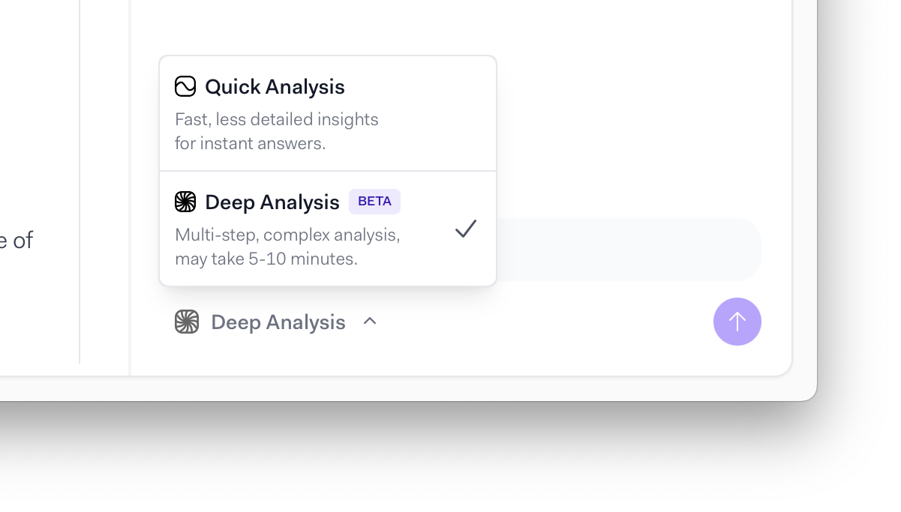
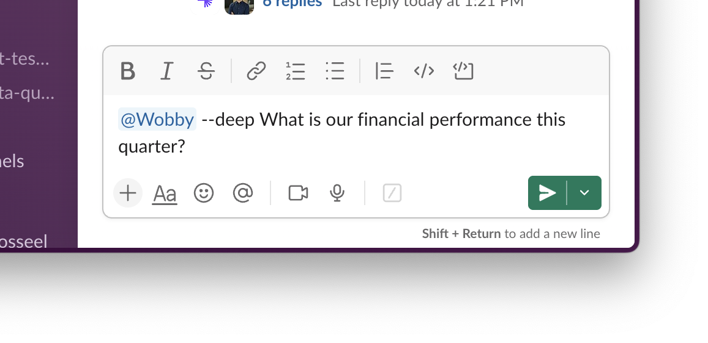
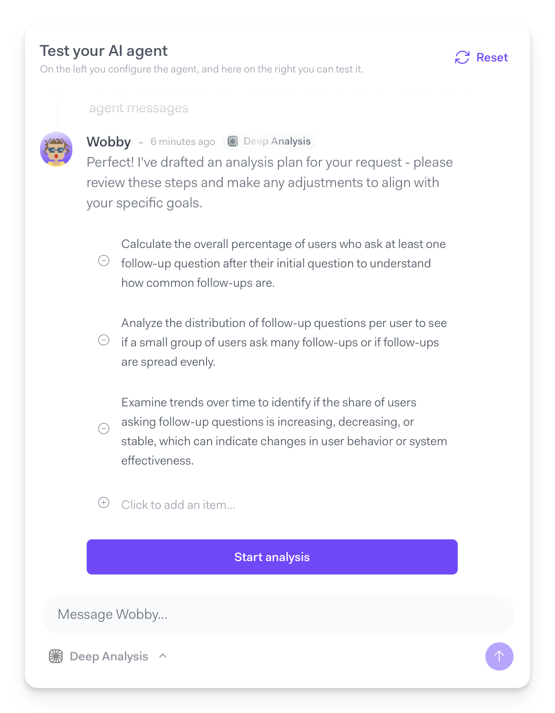
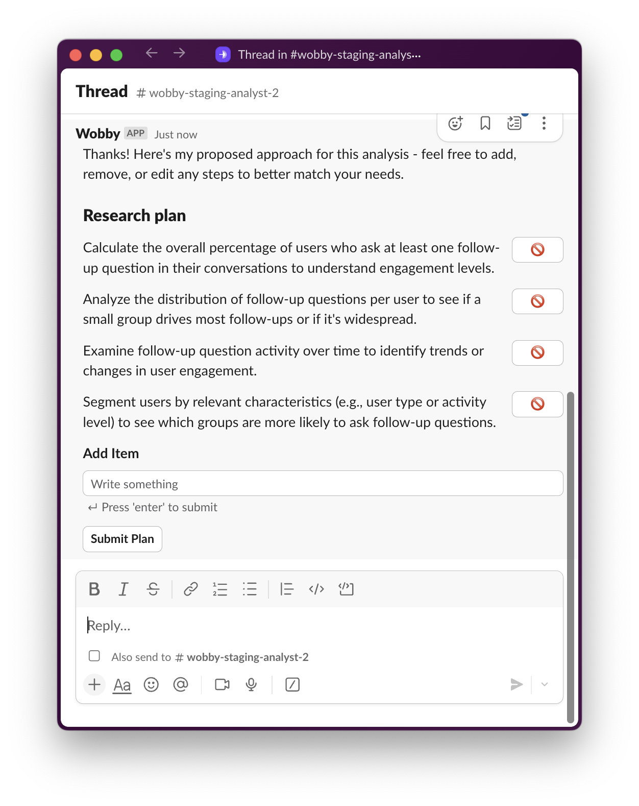
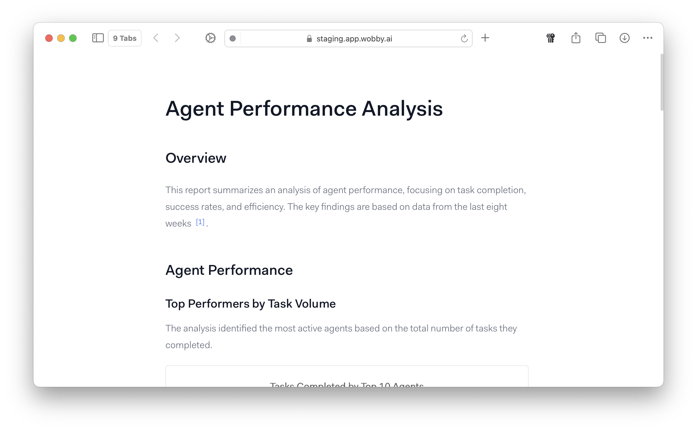

# Deep Analysis vs Quick Analysis

!!! warning

    **This feature has been retired.** Quick Analysis and Deep Analysis modes no longer exist. The AI Analyst is now a single, unified analyst that can handle any question — simple or complex — in any conversation. Reports can be built at any time without switching modes.

    See [Reports](reports.md) and [Plan Mode](plan-mode.md) for the new capabilities that replace Deep Analysis.

Deep Analysis is an advanced research mode that creates comprehensive reports for complex business questions. Unlike Quick Analysis, which provides immediate single-turn answers, Deep Analysis creates a research plan and executes multiple targeted analyses to deliver thorough insights.

## Quick Analysis

Quick Analysis provides immediate answers to specific questions in under 1 minute.

#### **Best for:**

* Daily metrics and KPI checks
* Specific data lookups
* Simple trend analysis
* Routine monitoring

#### **Examples:**

* "What was our revenue last month?"
* "Show me top 5 performing products this quarter"
* "How many new customers signed up yesterday?"

## Deep Analysis

Deep Analysis creates a structured research plan and executes multiple sub-analyses to answer complex questions.

#### **Best for:**

* Strategic decision support
* Root cause analysis
* Multi-dimensional research
* Comprehensive reporting

#### **Examples:**

* "Why did our customer churn increase in Q2?"
* "Analyze market performance across regions and identify growth opportunities"
* "What factors are driving profitability decline?"

### Using Deep Analysis

You can easily switch between Deep Analysis and Quick Analysis by selecting it when sending a message to Actian AI Analyst. If you are using Actian AI Analyst in Slack, you can trigger Deep Research by adding `--deep` to your query.

<figure><figcaption></figcaption></figure><figure><figcaption></figcaption></figure>

After processing your query, the agent will draft a plan, which you can adjust by either deleting items from it, or adding new ones.

<figure><figcaption></figcaption></figure><figure><figcaption></figcaption></figure>

Once you submit the plan, the agent will get to work creating a report, which once created can be shared with your team.

<figure><figcaption></figcaption></figure>

### How Deep Analysis Works

#### 1. Research Planning

The agent analyzes your question and creates a structured plan, breaking complex questions into specific sub-analyses.

#### 2. Systematic Execution

Each part of the plan is executed methodically, with the agent building insights progressively across multiple query iterations.

#### 3. Report Generation

Results are synthesized into a comprehensive report with:

* Executive summary with key findings
* Detailed analysis sections
* Supporting visualizations
* Actionable recommendations

### When to Use Deep Analysis

**Choose Deep Analysis when:**

* Your question involves multiple business areas or metrics
* You need to understand underlying causes of trends
* You're making strategic decisions requiring comprehensive data
* You need a detailed report for stakeholders

**Stick with Quick Analysis when:**

* You need immediate specific metrics
* You're doing routine monitoring
* Your question has a direct, simple answer
* Time sensitivity requires instant results

### Best Practices

When using Deep Analysis, agents are less sensitive to specific question phrasing, and can generally work out most concepts themselves, but adding some key details upfront can dramatically increase the usefulness of reports.

#### Effective Requests

* Be specific about scope: "Focus on enterprise customers in Q3"
* Mention key concerns: "Particularly worried about retention rates"
* Provide business context: "This analysis is for our board review"

#### Getting Better Results

* Review the research plan when presented
* Ask follow-up questions based on initial findings
* Use comprehensive reports for team discussions and decision-making

## Pricing and Availability

All plans include a limited amount of Deep Analysis and Quick Analysis messages. You can check your remaining quotas on the Billing page in Settings, or reach out to your account manager with any questions.
