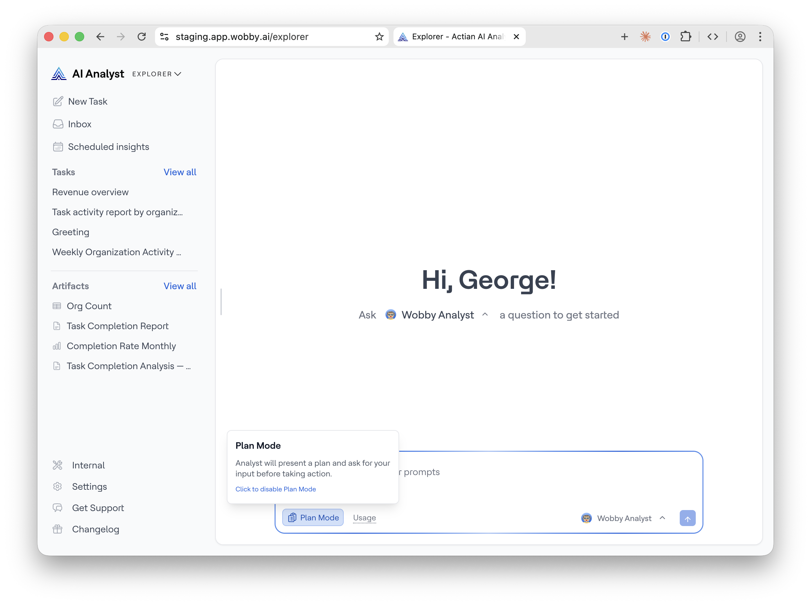

# Plan Mode

**Plan Mode** is an optional setting that adds one approval step before the AI Analyst begins any analysis. When enabled, the AI Analyst sends you a short plan — _"here's what I'm going to do"_ — and waits for you to approve before proceeding.

It's useful when you want to stay in control of how a complex question is approached, or when a wrong analysis would be costly to undo.

## Enabling Plan Mode

Look for the **\[Plan]** toggle pill to the left of the send button in the chat input bar. Click it to toggle Plan Mode on or off.

* Plan Mode is **off by default**
* When you enable it, it applies to all your conversations going forward — it's not limited to one session or one conversation
* A one-time tooltip appears when you first enable it: _"Plan mode on — AI Analyst will outline its approach before starting."_
* The toggle is disabled while the AI Analyst is generating a response

## How it works

### Using Plan Mode

When you send a message with Plan Mode on, the AI Analyst responds with a plan before doing any analysis. The plan describes the steps it intends and asks for your approval. If you reply affirmatively, the AI Analyst starts executing the plan. You can also ask the AI Analyst to make changes to the plan before executing it.

## When to use Plan Mode

Plan Mode is most valuable when:

* Your question spans multiple business areas and you want to steer the approach
* You're running a high-stakes analysis where a wrong interpretation would be time-consuming to redo
* You're using a [Saved Prompt](saved-prompts.md) for a structured recurring report and want the AI Analyst to confirm its approach each time

For routine questions — KPI lookups, quick comparisons, simple charts — Plan Mode adds unnecessary friction. Turn it off for day-to-day use and enable it when you need it.

## Plan Mode with Saved Prompts

Data teams can configure [Saved Prompts](saved-prompts.md) with Plan Mode pre-enabled. When a user runs such a prompt, Plan Mode is automatically on for that task — they don't need to toggle it manually. The preset applies to that task only and doesn't change the user's global Plan Mode setting.
