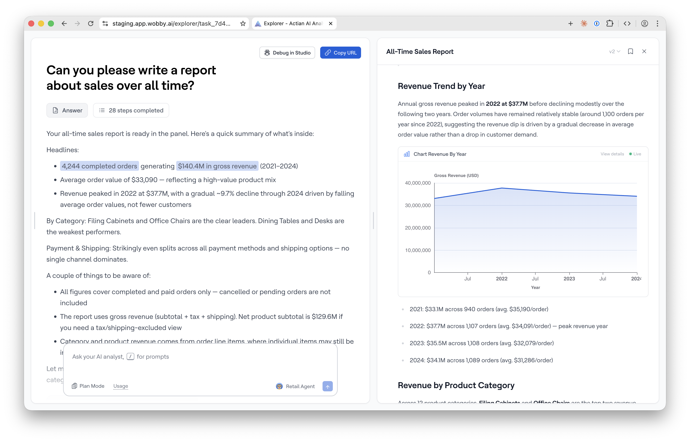

# Reports

A **Report** is a structured document that the AI Analyst builds from your conversation. It can include headings, paragraphs, bullet lists, blockquotes, and embedded charts and tables — all assembled in real time in a side panel alongside your chat. You can edit the report directly, save it as an Artifact, and revisit it from your Explorer library.

## How reports are created

There's no special mode to enable. Just chat with your AI Analyst as usual — when enough analysis has accumulated, the AI Analyst will offer to compile everything into a report. You can also request one at any time by asking directly:

> _"Can you put this together into a report?"_
> _"Build a report from everything we've looked at."_

If the AI Analyst offers a report and you'd rather continue chatting instead, just say no — the offer won't repeat, but you can always request one manually later.

## Editing a report

Between AI Analyst turns, the report is fully editable in the side panel:

* **Edit text** — click any heading, paragraph, list, or blockquote to edit it inline
* **Reorder blocks** — drag blocks up or down to rearrange them
* **Delete blocks** — remove any block you don't want

You can also ask the AI Analyst to make changes for you in natural language:

> _"Add a section on the European market after the charts."_
> _"Remove the summary paragraph."_
> _"Swap the first two charts."_

## Saving a report

Click **Save artifact** in the header of the side panel to save the report as an Artifact. The report is now in your Explorer library under **Artifacts** and can be found again from the sidebar.

Saving is always user-initiated — reports are never saved automatically.

## Live data in reports

Charts and tables inside a report re-run their queries every time the report is opened. This means the numbers always reflect your current data — the same report opened next month will show updated figures inside charts and tables.

## Viewing a saved report

Saved reports appear in the **Artifacts** section of the Explorer sidebar and on the **Artifacts page**. Click any report to open its detail view, which shows the full report with all blocks rendered, plus links back to the source conversation.

See [Artifacts](artifacts.md) for more on finding and managing saved outputs.
