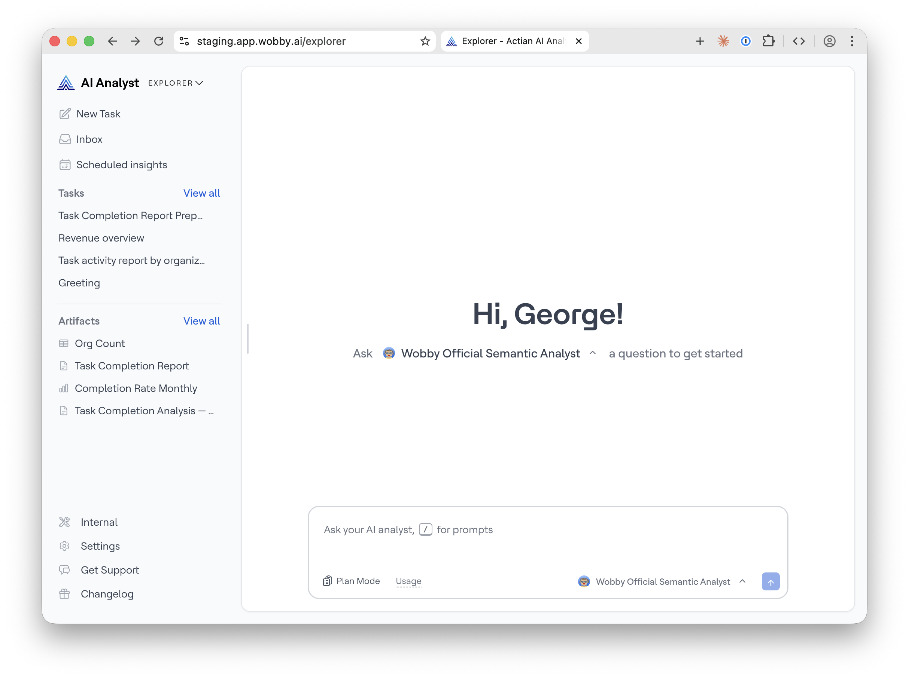

# Actian AI Analyst Explorer

Actian AI Analyst Explorer is the conversational interface where business users interact with AI Analysts. Ask questions in natural language and get answers as summaries, tables, and visualisations — all backed by live queries against your data warehouse.

## Studio vs Explorer

| **Actian AI Analyst Studio** | **Actian AI Analyst Explorer** |
| ----------------------------- | ------------------------------ |
| Data teams (setup & configuration) | Business teams (daily use) |
| Connect data sources, build semantic layer | Ask questions, get insights |
| Debug queries, manage templates | Save results, build reports |
| Configure AI Analyst behaviour | Interact with configured AI Analysts |

## Getting started

When you open an AI Analyst in Explorer, the homepage shows two tabs to help you get started:

* **Get started** — AI-generated [Suggestions](../../ai-analysts/creating-an-agent/suggestions.md) organised by category, to help you discover what the analyst can do
* **Saved prompts** — Your team's curated library of proven queries, ready to run in one click

You can also type your own question directly in the chat input at the bottom of the screen. Type `/` to quickly access [Saved Prompts](saved-prompts.md) mid-conversation.

## Next steps

* [Asking Questions](asking-questions.md) — how conversations work, follow-ups, Plan Mode, and sharing results
* [Saved Prompts](saved-prompts.md) — save and reuse your team's best queries
* [Plan Mode](plan-mode.md) — let the AI Analyst outline its approach before starting
* [Reports](reports.md) — build structured reports from your analysis
* [Artifacts](artifacts.md) — save and revisit charts, tables, and reports
* [Tips for Asking Questions](tips-for-quick-analysis.md) — how to write effective questions
