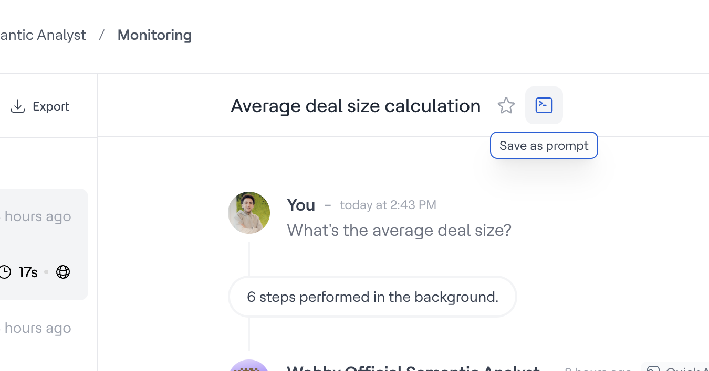

# Saved Prompts

Saved Prompts are human-curated, org-wide prompt templates scoped to a specific AI Analyst. Once saved, any user in your workspace can run them from the Explorer homepage or by typing `/` in the chat input.

Only [Admins](../../settings/members.md) can create, edit, or delete saved prompts.


Looking for how to _use_ saved prompts as a [User](../../settings/members.md)? See [Saved Prompts in Explorer](../../agent/working-with-agents/saved-prompts.md).


<figure><figcaption></figcaption></figure>

## Saving a prompt from a completed conversation

The quickest way to add a saved prompt is directly from a result you know works:

1. Open the completed conversation in Explorer or Studio
2. Click the **command icon** on the task
3. The prompt is immediately saved to the org library for that AI Analyst
4. A toast notification confirms the save — you can edit the title inline at this point

The title is auto-derived from the prompt text, but rename it to something descriptive (e.g. "Weekly Revenue by Region" rather than the raw question).


Only the prompt is saved — not the answer. Answers go stale as your data changes. The value is the proven question that reliably produces a good result.


## Managing saved prompts in Studio

To view and manage all saved prompts for an AI Analyst:

1. Navigate to the AI Analyst in Studio
2. Open the **Saved Prompts** tab (alongside Instructions, Suggestions, etc.)

From here you can:

* **View** all saved prompts, with the prompt text and a link to the original task (if applicable)
* **Add** a new prompt manually — without needing to save it from a conversation first
* **Edit** the title or prompt text of any saved prompt
* **Delete** prompts that are no longer relevant
* **Run** a prompt directly from the tab to open a pre-filled conversation

## Variable placeholders

Prompts can include placeholders like `[region]` or `[timeframe]`. When a user selects a prompt with placeholders — either from the homepage or via the `/` trigger — the placeholder text is highlighted for quick fill-in, with Tab to jump between them.

Example: `Show me revenue by [region] for [timeframe]`

## Using saved prompts for regression testing

When you iterate on the semantic layer or agent instructions, your saved prompts become a set of "golden queries" — the canonical questions this AI Analyst must answer correctly.

After making changes to a model, metric, or guideline, run through your saved prompts from the Saved Prompts tab to verify the AI Analyst still produces the right results. You can also use the `/` trigger in a Studio chat session to quickly pull up any saved prompt mid-conversation.
