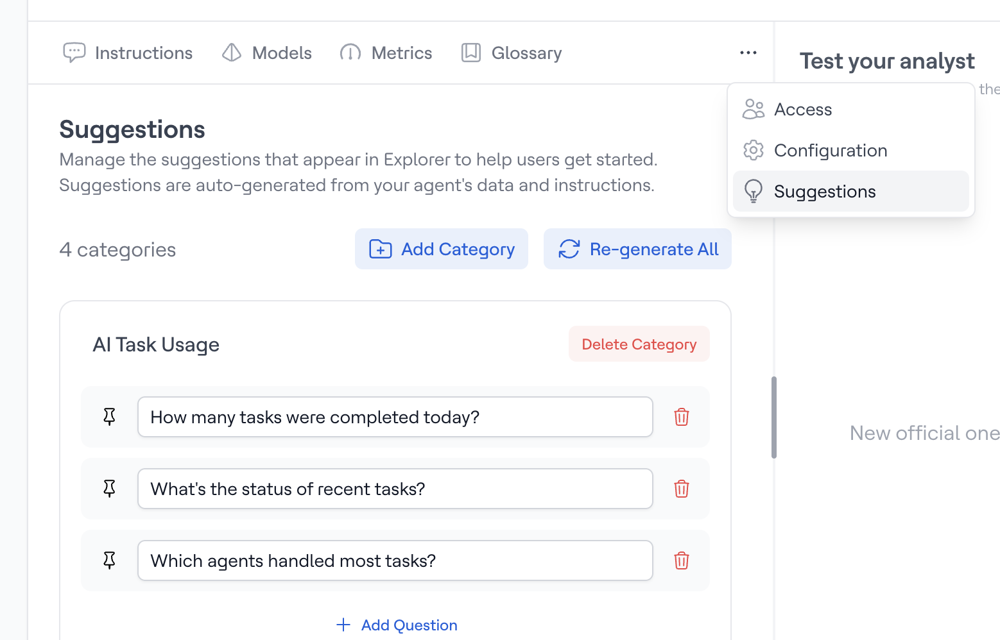

# Suggestions

Suggestions are pre-configured questions that appear in Actian AI Analyst Explorer to help users get started with your agent. They serve as conversation starters and showcase what your agent can do.

!!! info

    Looking for a way to save and reuse your team's proven queries? That's [Saved Prompts](../../agent/working-with-agents/saved-prompts.md) — a separate feature designed for retrieval of known-good questions, rather than discovery.

<figure><figcaption></figcaption></figure>

### Why Suggestions Matter

Suggestions help users in two ways:

1. **Onboarding** - New users can see what kinds of questions your agent can answer
2. **Discovery** - Surface important metrics and insights users might not think to ask about

### Managing Suggestions

#### Categories

Suggestions are organized into categories (e.g., "Revenue Analytics", "Customer Insights"). Each category groups related questions together.

To add a new category:

1. Click **Add Category**
2. Enter a category name
3. Add suggestions to the category

#### Auto-Generated Suggestions

Actian AI Analyst can automatically generate suggestions based on your agent's connected data and instructions:

1. Click **Re-generate All** to create suggestions automatically
2. Review the generated questions
3. Edit or delete suggestions that don't fit
4. Add custom suggestions for business-critical metrics

#### Custom Suggestions

You can add your own suggestions to ensure important questions are always visible:

1. Click the **+** button in any category
2. Enter your question
3. The suggestion will appear in Explorer immediately

### Best Practices

* Keep suggestions specific and actionable (e.g., "Show revenue by region for Q4" vs "Tell me about revenue")
* Include a mix of simple lookups and deeper analyses
* Update suggestions when you add new data sources or models
* Use category names that match your business terminology
