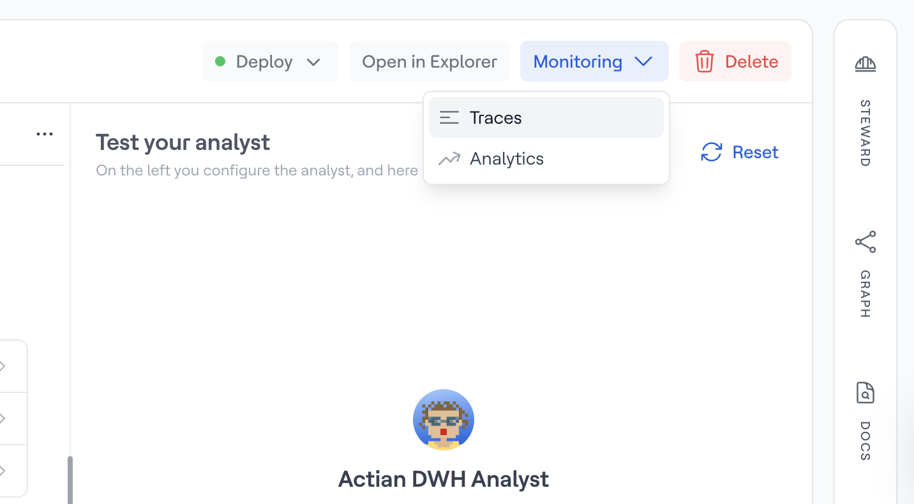

# Monitoring

In Studio, the Monitoring section gives [Admins](../../settings/members.md) full visibility into how an AI Analyst is being used. For each AI Analyst you manage, you can:

- Browse every conversation a user has had with the analyst (Traces)
- View aggregate usage statistics and trends over time (Analytics)

To access Monitoring, click the *Monitoring* button in the top action bar of any AI Analyst, then choose *Traces* or *Analytics* from the dropdown.

<figure><figcaption>
The Monitoring dropdown on an AI Analyst page
</figcaption></figure>
