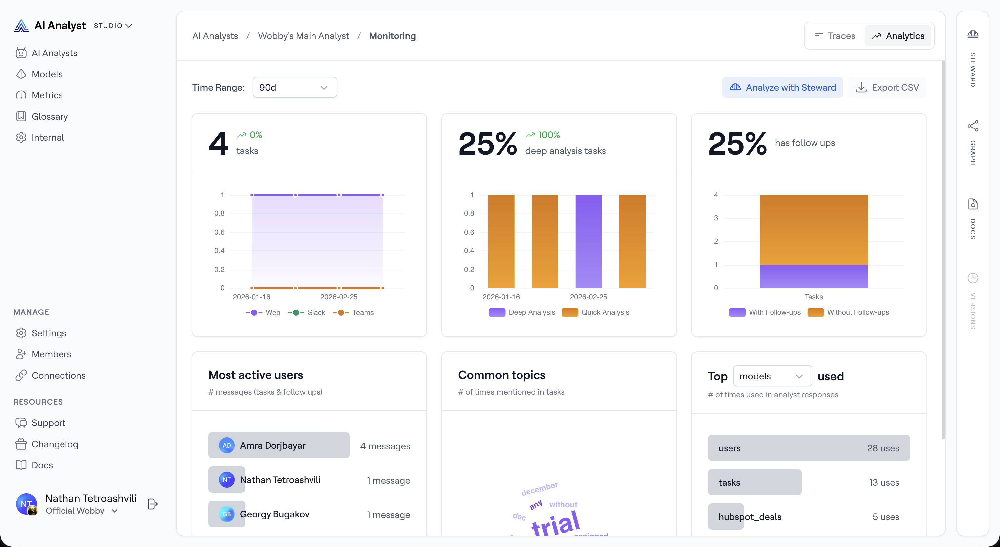

# Analytics

In Studio, the *Analytics* tab gives Admins an aggregate view of how an AI Analyst is being used over time. Instead of individual conversations, it shows rolled-up statistics — total sessions, usage trends, most active users, common topics, and which parts of the semantic layer are being used most.

## Accessing Analytics

1. In Studio, go to *AI Analysts* and select the analyst you want to inspect.
2. Click the *Monitoring* button in the top action bar and select *Analytics*.

<figure><figcaption>
The Analytics view showing usage statistics for an AI Analyst
</figcaption></figure>

## Time Range

Use the *Time Range* selector to filter all statistics to the last *7 days*, *30 days*, or *90 days*.

## Statistics Cards

### Total Tasks

Shows the total number of analyst sessions in the selected time period, with a trend indicator comparing the first and second halves of the period.

The chart below the number shows daily session volume broken down by channel (Web, Slack, Teams), so you can see which surfaces are driving usage.

### Deep Analysis % _(historical)_

!!! info

    Quick Analysis and Deep Analysis modes have been retired. This metric reflects historical sessions only — new sessions no longer have a mode assigned.

Shows the percentage of historical sessions that used Deep Analysis mode.

### Follow-up %

Shows the percentage of sessions that included at least one follow-up question. A high follow-up rate can indicate that users are engaging deeply with the analyst — or that initial answers weren't fully satisfying.

## Most Active Users

Lists the top 5 users by total message count (initial questions plus follow-ups) in the selected period. This helps you understand who is getting the most value from the analyst and who to talk to for feedback.

## Common Topics

A word cloud showing the most frequently mentioned topics across all sessions in the selected period. Larger words appear more often. Hover over a word to see the exact mention count.

This is useful for understanding what business questions the analyst is most often asked, which can inform how you prioritise semantic layer improvements.

## Top Semantic Layer Usage

Shows the top 5 most-used items from the semantic layer, based on how often they appeared in analyst responses. Use the selector to switch between:

- *Metrics* — the most-used calculated metrics
- *Models* — the most-queried data models
- *Glossary Terms* — the most-referenced glossary definitions

This gives you a data-driven view of which parts of your semantic layer are working hard, and which may be underused or missing entirely.

## Analyze with Steward

Click *Analyze with Steward* to open the Steward AI Agent sidebar with a pre-filled prompt asking Steward to analyse the usage data for this analyst. Steward can identify patterns, surface anomalies, and suggest improvements to the semantic layer based on the analytics.

[Learn more about Steward →](../../steward-ai-agent/using-steward.md)

## Exporting Analytics

Click *Export CSV* to download all statistics for the selected time range as a spreadsheet.
