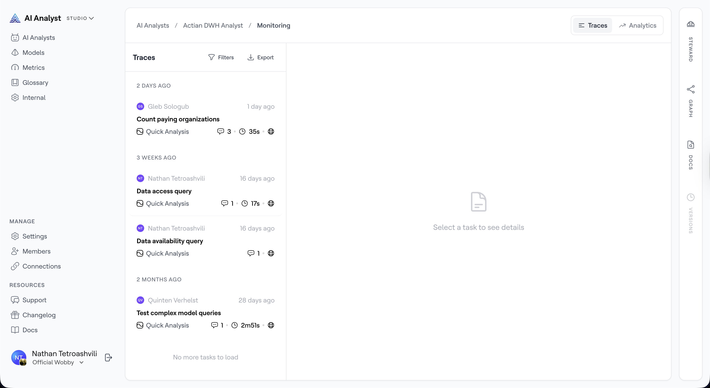

# Traces

In Studio, the *Traces* tab gives [Admins](../../settings/members.md) a full log of every conversation that has taken place with an AI Analyst. Each conversation — from a user asking a question to the analyst returning an answer — is recorded as a single trace. You can browse, filter, and open any trace to replay the full conversation.

!!! info

    Only [Admins](../../settings/members.md) can view all traces. [Users](../../settings/members.md) can only see their own conversations.

## Accessing Traces

1. In Studio, go to *AI Analysts* and select the analyst you want to inspect.
2. Click the *Monitoring* button in the top action bar and select *Traces*.

The page has a two-panel layout:
- *Left panel* — a scrollable list of all traces for this AI Analyst, grouped by date.
- *Right panel* — the full conversation detail for whichever trace you have selected.

<figure><figcaption>
The Traces view showing a list of user sessions grouped by date
</figcaption></figure>

## What Each Trace Shows

Each trace in the list displays:

| Field | Description |
| ----- | ----------- |
| User | The name and avatar of the user who ran the session |
| Time | When the session took place (relative, e.g. "2 hours ago") |
| Question | The user's original question or prompt |
| Analysis mode | *Deep Analysis* or *Quick Analysis* badge |
| Channel | Where the question was asked — Web, Slack, or Teams |
| Feedback | Whether the user rated the answer thumbs up or thumbs down |
| Comments | Number of comments or annotations on the trace |

## Filtering Traces

Use the filter bar at the top of the left panel to narrow down the list. Available filters:

- *Mode* — show only Deep Analysis or Quick Analysis sessions
- *Feedback* — filter by positive, negative, or no feedback
- *Follow-ups* — show only sessions that included follow-up questions
- *Assumptions* — show only sessions where the analyst made assumptions
- *Channel* — filter by Web, Slack, or Teams
- *Starred* — show only traces you have starred
- *User* — filter by a specific user
- *Duration* — filter by how long the session took

## Viewing a Trace

Click any trace in the left panel to open the full conversation in the right panel. You will see:

- The user's original question and all follow-up messages
- Every response from the AI Analyst, including reasoning steps, charts, and tables
- The analysis mode used for each response

This is useful for understanding how the analyst reasoned through a question, identifying where it may have gone wrong, and reviewing the quality of answers before acting on any feedback.

## Starring Traces

Click the star icon on a trace to mark it for easy reference later. You can then filter the list to show only starred traces.

## Exporting Traces

Click *Export CSV* to download the current filtered list of traces as a spreadsheet. The export includes the question, user, timestamp, mode, channel, duration, and feedback for each trace.

!!! info

    The export button has a short cooldown after each download to prevent duplicate exports.

