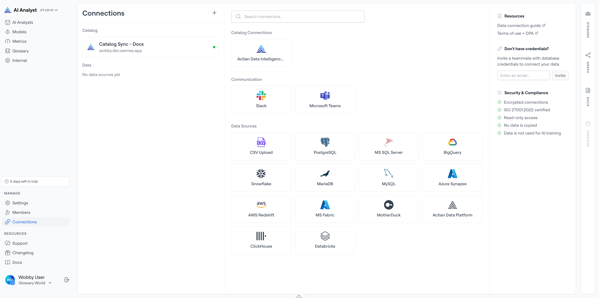
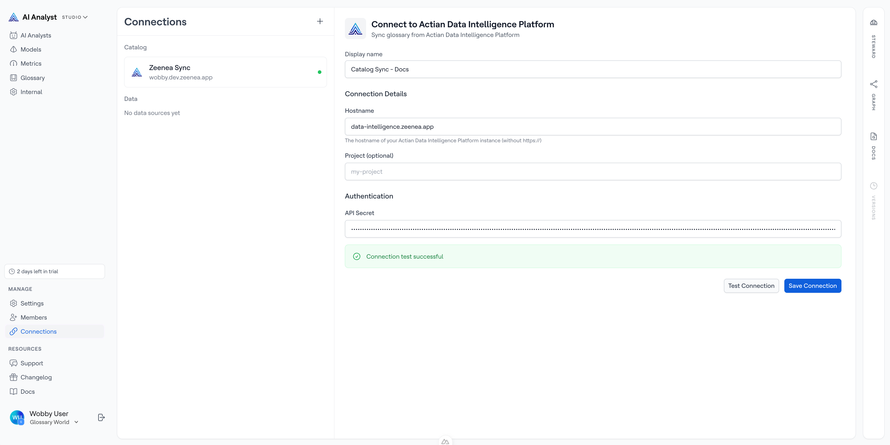
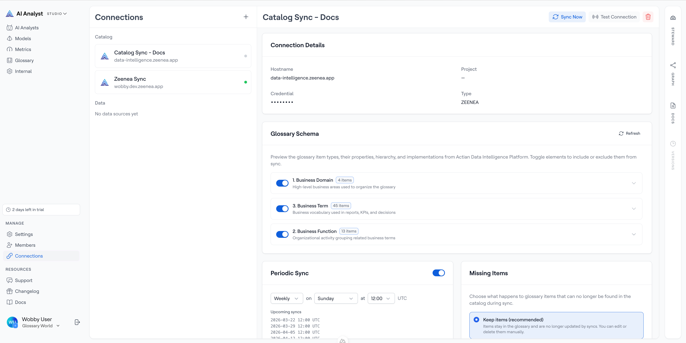
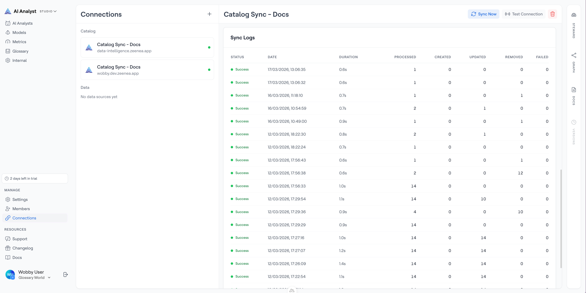
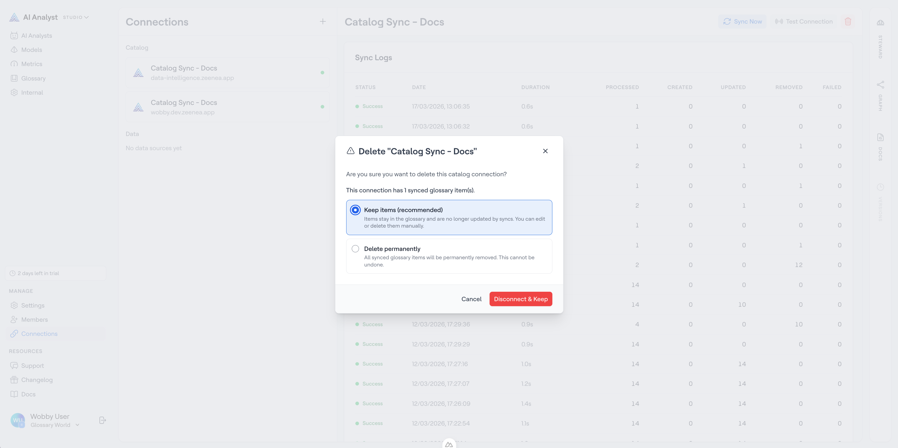

# Actian Data Intelligence Platform

The Actian Data Intelligence Platform is a cloud-native data catalog and metadata management platform. Connecting it to Actian AI Analyst creates a closed-loop system: the business definitions and governance metadata your data team maintains in the catalog flow directly into your AI Analysts' knowledge base — so every answer is grounded in your organization's authoritative terminology.

## What gets synced

When you connect the Actian Data Intelligence Platform, Actian AI Analyst imports:

- **Glossary terms** — names, definitions, and descriptions from your catalog's semantic layer
- **Synonyms** — alternative names for each term
- **Hierarchies** — parent/child relationships between terms (e.g. "Revenue" is a parent of "Net Revenue")
- **Item type metadata** — which category of concept each term belongs to (e.g. KPI, Business Object, Domain)
- **Implementation links** — references connecting glossary terms to their physical data assets

Synced terms appear in your [Glossary](../../semantic-layer/glossary.md) and are immediately available to all AI Analysts in your organization.

## Prerequisites

Before setting up the connection, you will need:

- A running Actian Data Intelligence Platform instance
- The hostname of your instance (e.g. `your-org.zeenea.com`)
- An **API secret** (token) with read access to the semantic layer. Generate this in the Actian Data Intelligence Platform under your account settings.
- Optionally, the name of a specific **project** if you want to limit the sync to one project in your catalog.

## Setting up the connection

1. In Actian AI Analyst Studio, go to **Connections** in the left navigation.
2. Click the **+** button to add a new connection.
3. Select **Actian Data Intelligence Platform** from the catalog connectors section.

4. Fill in the connection form:

| Field | Description |
| ----- | ----------- |
| **Connection name** | A label to identify this connection (e.g. "Production Catalog") |
| **Hostname** | Your Actian Data Intelligence Platform instance URL (e.g. `your-org.zeenea.com`) |
| **Project** | _(Optional)_ Limit the sync to a specific project in your catalog. Leave blank to sync all projects. |
| **API secret** | The API token used to authenticate with your catalog |

5. Click **Test Connection** to verify that Actian AI Analyst can reach your catalog. A success message will show the number of glossary items found.
6. Click **Save Connection**.

You will be taken to the catalog connection detail page.

## Configuring the sync

After creating the connection, configure how and when Actian AI Analyst syncs from your catalog.

### Choosing which item types to sync

The **Glossary Schema** card shows all the item types (concept categories) defined in your catalog's metamodel. By default, all item types are included.

To exclude an item type from syncing, toggle it off. This is useful if your catalog contains technical or internal categories that aren't relevant to business users.

You can also expand each item type to see and control:

- **Hierarchy links** — parent/child relationships between items of this type
- **Implementation links** — references from terms to physical data assets

Toggle off any relationship types you don't want imported.


Changes to item type toggles take effect on the next sync. Click **Sync Now** to apply them immediately.


### Setting a sync schedule

Use the **Periodic Sync Schedule** card to automate syncing on a regular cadence.

1. Enable the toggle to activate the schedule.
2. Choose a recurrency:
   - **Daily** — syncs every day at the time you choose
   - **Weekly** — syncs on a specific day of the week at the time you choose
3. Set the sync time (in UTC).

The card shows the next 5 scheduled sync dates so you can confirm the schedule is correct.

To run a sync immediately at any time, click **Sync Now** in the page header.

### Handling removed terms

When a glossary item is removed from your catalog, Actian AI Analyst needs to decide what to do with the synced term. Use the **Removed Items Behavior** card to choose:

| Option | What happens |
| ------ | ------------ |
| **Retain** _(default)_ | The term stays in your Glossary but is marked as removed. It remains visible to data teams but is no longer used by AI Analysts. |
| **Delete** | The term is permanently deleted from your Glossary when it is no longer found in the catalog. |


Choosing **Delete** is irreversible. Any manual edits or mappings you added to those terms will be lost.


## Monitoring sync health

### Connection health

The **Connection Health** card shows the overall reliability of the connection based on recent syncs:

- **Healthy** — recent syncs completed without errors
- **Degraded** — some recent syncs had partial failures
- **Unhealthy** — recent syncs are failing

The card also shows the last synced timestamp and the number of records processed in the last sync.

### Sync logs

The **Sync Logs** card shows a history of every sync that has run, including:

- Status (Success / Partial Success / Failure)
- Date and time
- Duration
- Number of records created, updated, removed, and failed
- Error message, if the sync failed

Use sync logs to diagnose issues — for example, if a batch of items failed to import, the error message will tell you why.

## Editing and deleting the connection

### Renaming the connection

Click the connection name at the top of the detail page to edit it inline. Changes are saved automatically.

### Updating credentials

If your API secret rotates, update it by editing the connection. Go to the connection detail page and update the **API secret** field, then save.

### Deleting the connection

Click **Delete** in the page header. A confirmation dialog will appear asking what to do with the glossary terms that were synced from this connection:

- **Retain** — terms stay in your Glossary as removed
- **Delete** — terms are permanently removed

Choose **Retain** if you want to review and keep useful terms. Choose **Delete** for a clean removal.

