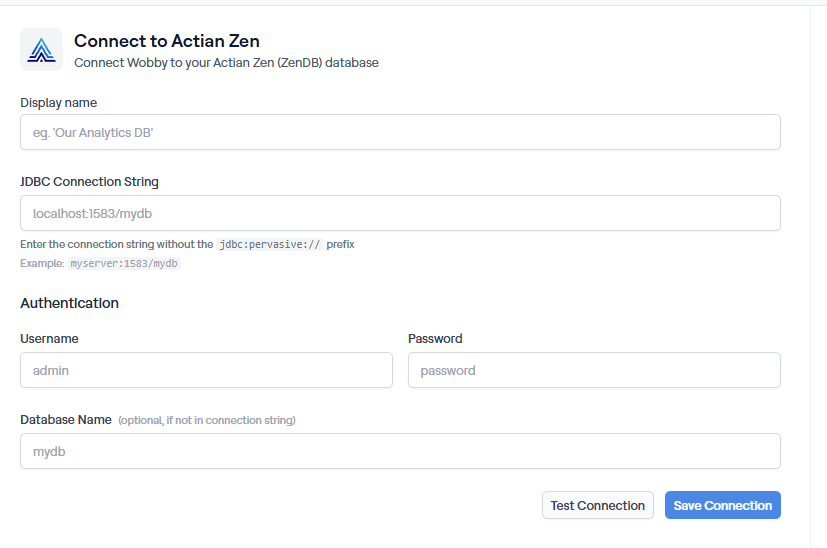

# Actian Zen

## Connect Actian Zen to Actian AI Analyst

To connect your Actian Zen database to Actian AI Analyst, follow these steps:

1. Create a **dedicated user** with read-only access.
2. Grant **read-only permissions** on the tables you want to expose.
3. Allow **Actian AI Analyst's IP address** through your firewall or network rules.
4. Set up the connection in the **Actian AI Analyst interface**.

> **Actian AI Analyst's agents only run read-only queries** on your data. No write permissions are required.

***

### 1. Create a Read-Only User in Actian Zen

Create a dedicated database user for Actian AI Analyst with read-only access. Run the following SQL as a user with administrative privileges:

```sql
-- Create a user for Actian AI Analyst
CREATE USER actian_analyst_user IDENTIFIED BY '<your_secure_password>';
```

***

### 2. Grant Read-Only Access to Your Tables

Grant Actian AI Analyst read access to the tables you want to expose:

```sql
-- Grant read-only access to a specific table
GRANT SELECT ON your_table_name TO actian_analyst_user;
```

Repeat this for each table you want Actian AI Analyst to access.

!!! info

    Actian Zen uses a flat table namespace — there are no schemas. Grant access per table.


***

### 3. Allow Actian AI Analyst's IP Address

If your Actian Zen instance is protected by firewall or network rules, allow inbound traffic from Actian AI Analyst's static IP:

```
34.77.172.158
```

***

### 4. Set Up the Connection in Actian AI Analyst

1. Click **Connections → Plus button → Select Actian Zen**.
2. Fill in the following details:
    * **Display name**: a friendly name for this connection (e.g. `Our Analytics DB`)
    * **JDBC Connection String**: your Actian Zen host and port in the format `host:port/database` (e.g. `zen-server.example.com:1583/mydb`) — do not include the `jdbc:pervasive://` prefix
    * **Username**: `actian_analyst_user`
    * **Password**: the password you defined earlier
    * **Database Name** _(optional)_: override the database name if it differs from the one in the connection string
3. Test the connection and save.

<figure><figcaption>The Actian Zen connection form</figcaption></figure>

***

### That's It!

Actian AI Analyst is now connected to your Actian Zen database and can start delivering insights with natural language queries — no SQL or dashboards needed.
