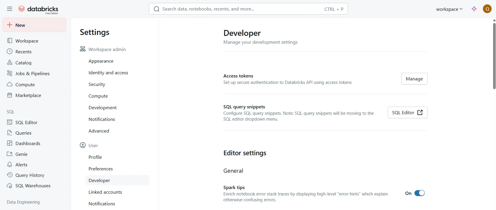
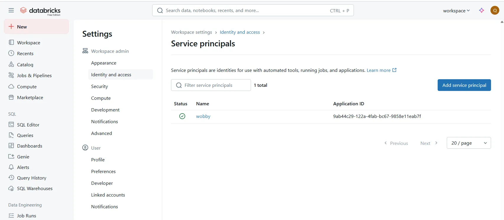

# Databricks

To connect Actian AI Analyst to your Databricks SQL environment, follow the steps below. Actian AI Analyst uses read-only access to query data from your Unity Catalog via SQL Warehouses.

> ✅ Actian AI Analyst supports both Personal Access Tokens and DBX's Service Principals for authentication.

### 1. Choose Your Authentication Method

You can connect Actian AI Analyst using either of the following:

* **Personal Access Token**\
  Easiest to set up for individual access.
* **Service Principal (OAuth)**\
  Better for automated access, access control, and secret rotation.

***

### (Option A) Use a Personal Access Token

1. In the Databricks UI, go to:\
   **Top right avatar → User Settings → Developer → Access Tokens**
2. Click **Generate new token**
    * Add a descriptive comment
    * Set a reasonable lifetime
3. **Copy the token value immediately** — it can't be viewed again.

<figure><figcaption></figcaption></figure>

***

### (Option B) Use a Service Principal (OAuth)

1. Create a new **Service Principal** in Azure AD
    * Note the **Application (Client) ID** and **Tenant ID**
2. Generate a **Client Secret**
    * Go to: Certificates & Secrets → **New client secret**
    * **Copy the secret value** (can't retrieve later)
3. In Databricks:
    * Open **Account Console** or **Workspace Admin → Service principals**
    * Add the app (Service Principal) by its client ID
4. Assign workspace entitlements:
    * ✅ Must have **Access to SQL**
    * (Optional) Grant **Workspace access** if needed
5. Grant access to data:
    * Add the Service Principal to a group **or** grant access directly in SQL Warehouse and Unity Catalog

<figure><figcaption></figcaption></figure>

***

### 2. Grant Required Permissions in Databricks

To allow Actian AI Analyst to read metadata and query tables, the identity (user or service principal) must have:

* **SQL Warehouse**:\
  `CAN USE` on the target warehouse\
  \&#xNAN;_Databricks → SQL Warehouses → Select warehouse → Permissions_
* **Unity Catalog**:
  * `USAGE` on each **catalog** you want Actian AI Analyst to scan
  * `USAGE` on **schemas** inside those catalogs
  * `SELECT` on **tables** or **views** you want Actian AI Analyst to query

> ℹ️ Missing privileges will result in empty catalog/schema/table lists during metadata sync.

***

### 3. Collect Connection Details

You'll need the following values from your Databricks SQL Warehouse:

| Field         | Where to find it                                                                     |
| ------------- | ------------------------------------------------------------------------------------ |
| **Host**      | SQL Warehouse connection dialog (e.g. `adb-1234567890123456.17.azuredatabricks.net`) |
| **Port**      | Usually `443` (default)                                                              |
| **HTTP Path** | SQL Warehouse → Connection Details (e.g. `/sql/1.0/warehouses/abcd1234efgh5678`)     |
| **Catalogs**  | Unity Catalog catalogs Actian AI Analyst should scan (start with `main` or `default` if unsure)  |

***

### 🚧 Troubleshooting Tips

| Issue                            | Possible Cause                                                                  |
| -------------------------------- | ------------------------------------------------------------------------------- |
| **Empty catalog list**           | Missing `USAGE` on catalogs or pointing to legacy Hive instead of Unity Catalog |
| **Cannot see schemas or tables** | Missing `USAGE` or `SELECT` at schema/table level                               |
| **Connection test fails**        | Incorrect token/secret, wrong HTTP path, or firewall/network issue              |
