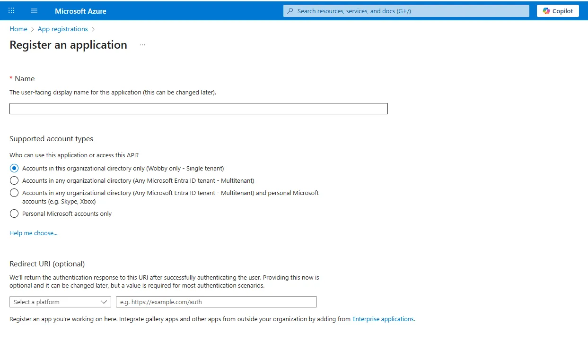
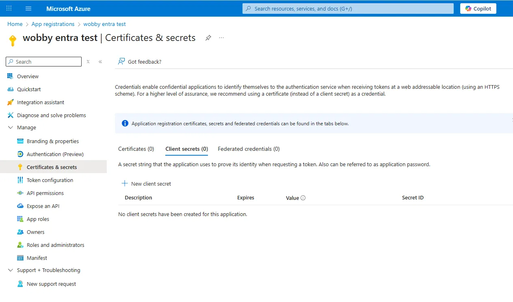

# Microsoft Fabric

Actian AI Analyst can connect directly to your Microsoft Fabric data warehouse using a service principal from your Microsoft Entra (Azure AD) tenant.

#### Step 1: Create an App Registration in Microsoft Entra ID

1. Go to the **Azure Portal** → **Microsoft Entra ID** → **App registrations**.
2. Click **New registration**.
    * **Name**: Can be anything (e.g., `actian-analyst-fabric-access`).
    * **Supported account types**: _Single tenant_.
    * **Redirect URI**: Leave blank.

<figure><figcaption></figcaption></figure>

***

#### Step 2: Note Your Tenant and Client IDs

After creating the app, copy:

* **Directory (tenant) ID**
* **Application (client) ID**

You'll need these later for the Actian AI Analyst connection form.

***

#### Step 3:  Create a Client Secret

1. In your app registration, go to **Certificates & secrets**.
2. Under **Client secrets**, click **New client secret**.
3. Add a description (e.g., `actian-analyst-fabric-secret`) and choose an expiry period.
4. **Important**: Copy the **Value** (not the Secret ID) immediately and store it securely.
    * You won't be able to view the value again once you leave the page.


<figure><figcaption></figcaption></figure>

***

#### Step 4:  Grant Database Access to the Service Principal

Run the following commands in your Fabric SQL database to grant read access:

```sql
CREATE USER [<service-principal-name>] FROM EXTERNAL PROVIDER;
ALTER ROLE db_datareader ADD MEMBER [<service-principal-name>];
```

* Replace `<service-principal-name>` with your app registration's display name.
* Use `db_datareader` for read-only access (recommended).
* Only use `db_owner` if the agent needs full control — generally **not** needed for Actian AI Analyst.

***

#### Step 5:  Add the Connection in Actian AI Analyst

1. Click **Connections → Plus button → Select Microsoft Fabric**.
2. Fill in the form:

| Field             | Value                                                                                   |
| ----------------- | --------------------------------------------------------------------------------------- |
| **Display Name**  | How you want the source to appear in Actian AI Analyst                                  |
| **SQL Host**      | Your Fabric SQL host (ends with `.datawarehouse.fabric.microsoft.com`)                  |
| **Database**      | The Fabric database name                                                                |
| **Schema**        | The schema to use (often `dbo`)                                                         |
| **Tenant ID**     | From Step 2                                                                             |
| **Client ID**     | Application (client) ID from Step 2                                                     |
| **Client Secret** | From Step 3                                                                             |

***
