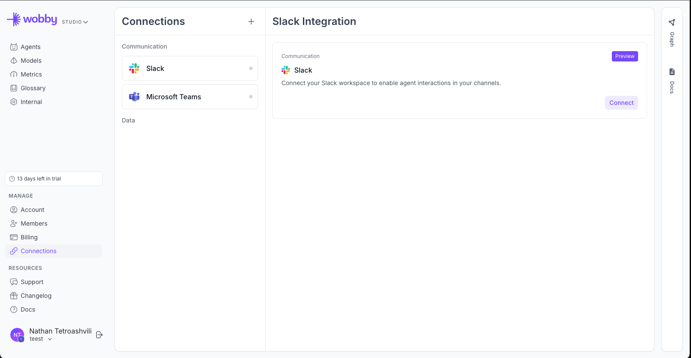
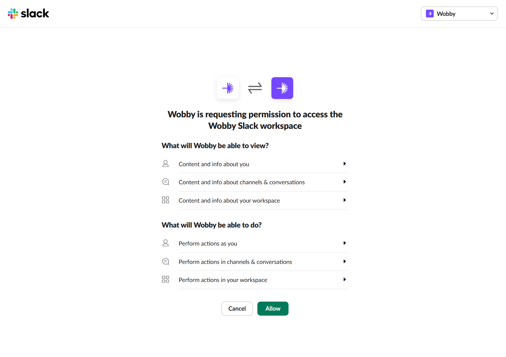
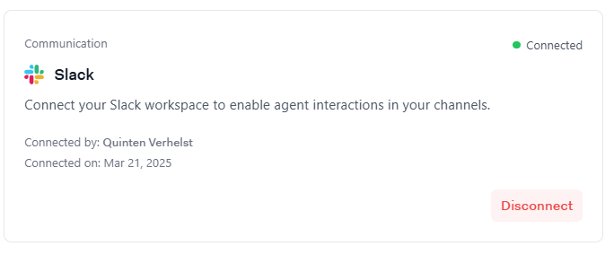
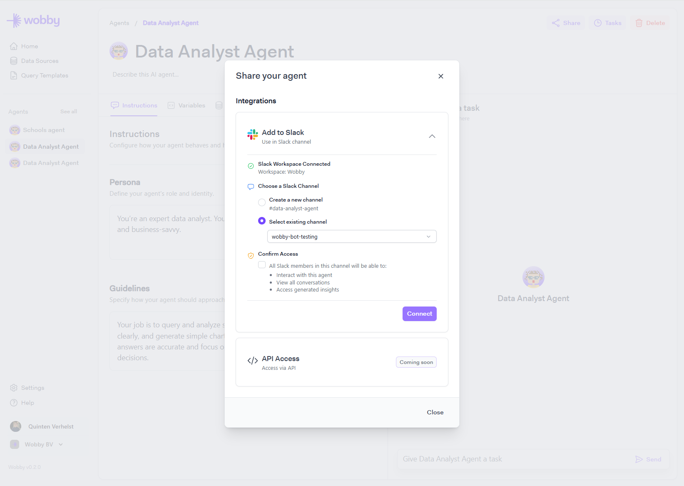
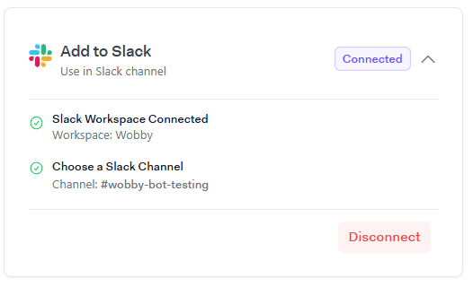
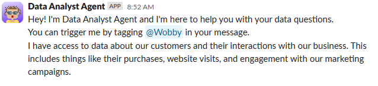

# Slack

Bring Actian AI Analyst's AI agents directly into your Slack workspace for fast, conversational access to business data.

By following this guide, you'll configure your Slack app, set up authentication, and deploy your agent to handle tasks.

***

### Step 1: Connect your slack workspace

Navigate to Connections

Click 'Slack' and then click 'Connect'

<figure><figcaption></figcaption></figure>

Review permissions and allow the app to connect to your workspace

<figure><figcaption></figcaption></figure>

Once connected: You should be redirected to the integration page and see connection details\\

<figure><figcaption>
Slack Connected
</figcaption></figure>

### Step 2: Connect agent to a slack channel

1. Navigate to an agent you wish to connect to a slack channel
2. On the top right, press share
3. Open up the slack integration and choose an existing channel or create a new one.
4. Confirm access by toggeling the checkbox acknowledging the permission.

<figure><figcaption></figcaption></figure>

After connecting you should see the following\\

<figure><figcaption>
Agent connected to channel
</figcaption></figure>

Once successfully connected, the agent will announce itself in the selected channel.\\

<figure><figcaption>
Agent message in channel
</figcaption></figure>

#### Step 3: Use the agent

You can trigger agent's by tagging them using @ActianAIAnalyst\
The agent will respond with reactions and as a reply to that message.\
Tagging the agent in a follow up to that thread will trigger a follow up task in the same conversation.

Add `--plan` to your query to trigger Plan Mode.

!!! warning

    The `--deep` flag has been removed and will no longer work. Use `--plan` instead.

***

## Integration health & tokens

### Bot token vs user token

When you connect Slack, an _org-level bot token_ is created automatically. This allows the bot to post messages and join _public_ channels without any additional setup.

You (or any Studio admin) can also connect a _personal user token_ by navigating to Connections > Slack and clicking "Connect". This walks you through an OAuth flow using your personal Slack account. The user token is required to invite the bot into _private_ Slack channels — without it, the bot cannot access private channels.

The user token is per-user, meaning each Studio admin can connect their own personal Slack account independently.

### Checking integration health

On the Connections > Slack page, the integration health panel shows the current status of both the bot token and user token:

* A green check indicates the token is valid and working.
* A red X indicates the token is invalid or has been revoked.

Use the refresh button to re-test the tokens at any time. If a token is shown as invalid, click "Reconnect" to go through the OAuth flow again and restore the connection.

### Disconnecting

The "Disconnect" button on the Connections > Slack page removes the org's Slack integration entirely. Once disconnected, any agents that were connected to Slack channels will stop responding to messages.

***

That's it! You're ready to use Actian AI Analyst's AI agents in Slack.

Need support? Send an email to info@wobby.ai - our team is happy to help!
