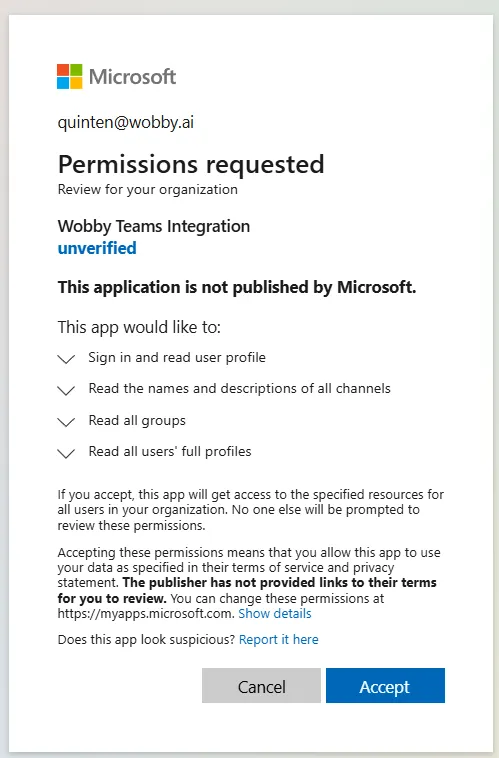
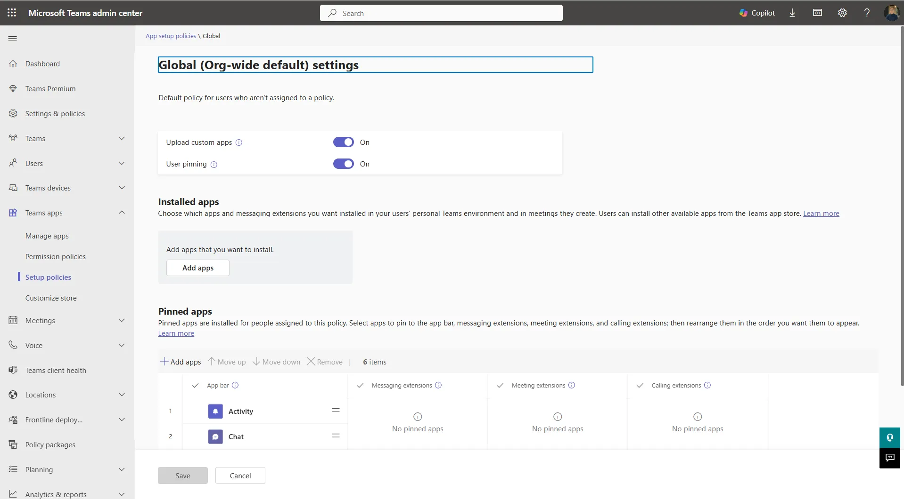
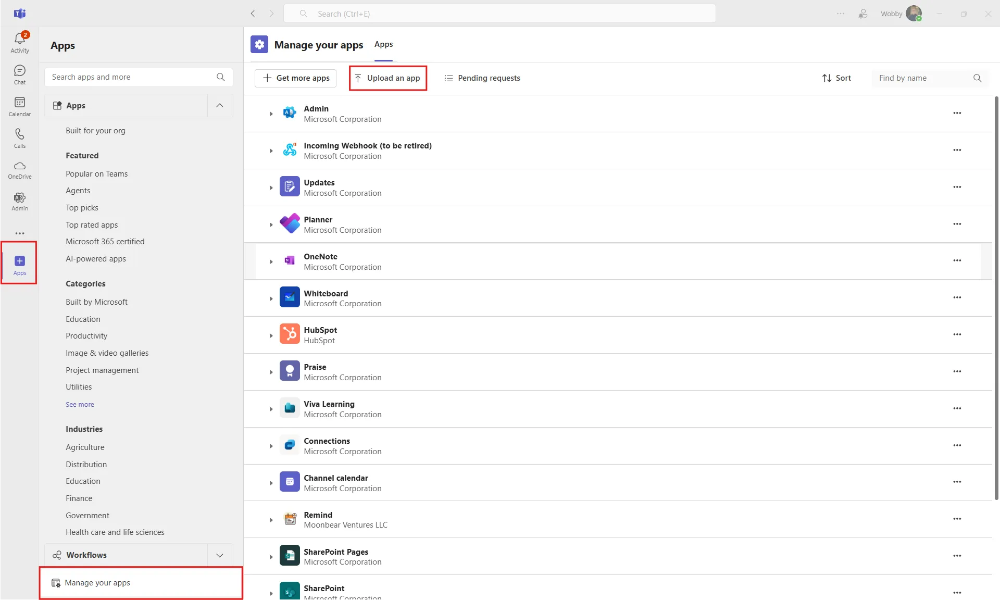
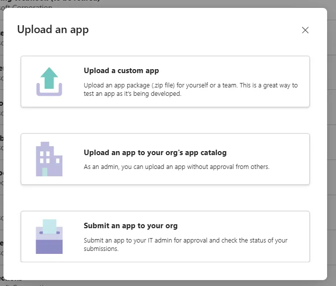
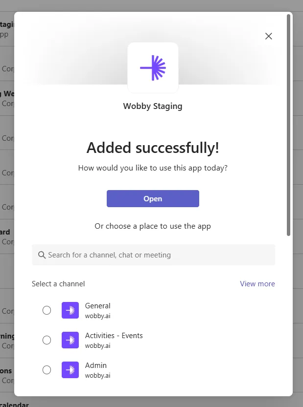
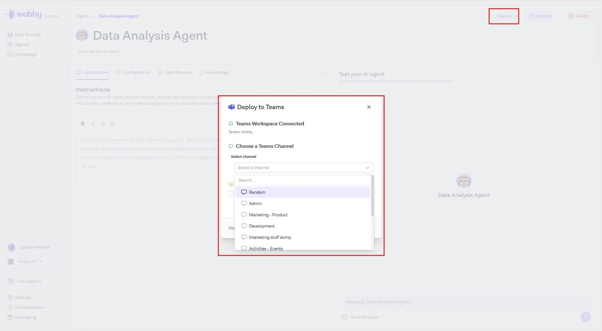

# Teams

Bring Actian AI Analyst's AI agents directly into your Microsoft Teams workspace for fast, conversational access to business data.

***

### Prerequisites

* **System administrator rights:** Integration setup must be completed by a system administrator on your Microsoft Tenant.
* **Teams Permissions:** You must have permission to upload custom apps in Teams. This may require your Teams system administrator to update app policies.

!!! info

    For most organizations, uploading a custom app is restricted. If you can't upload, ask your Teams system administrator to enable "Upload custom apps" for your user.

***

### Step 1: Start the Teams Integration in Actian AI Analyst

1. Go to **Actian AI Analyst** → **Settings** → [**Integrations**](https://app.wobby.ai/studio/settings/integrations).
2. Find **Microsoft Teams** and click **Connect**.
3. Authorize the Teams connection when prompted.
4. Once authorized, you'll be redirected to the Integrations page. Status should show **Connected**.

<figure><figcaption></figcaption></figure>

***

### Step 2: Download the Actian AI Analyst Teams Bot

1. Click **Download Teams Package** to get the ZIP package: [`teams-bot-package.zip`](https://app.wobby.ai/teams-bot-package.zip)

***

### Step 3: Enable Custom App Uploads (if needed)

To upload the Actian AI Analyst bot, your Teams policy must allow custom app uploads:

1. Open the **Microsoft Teams Admin Center**.
2. Navigate to **Teams Apps** → **Permission policies**.
3. Edit (or create) a policy for your user:
    * Set **Upload custom apps** to **On**.
    * Apply the policy to your account.

<figure><figcaption></figcaption></figure>

***

### Step 4: Upload the Bot to Teams

1. Open the **Teams desktop app**.
2. Go to **Apps** → **Manage your apps** → **Upload an app**.
3. Choose how you want to upload:
    * **Upload a custom app:**\
     Makes the bot available for you to add to specific channels.
    * **Upload an app to your org's app catalog:**\
     Makes the bot available for all users in your organization. (Recommended for team-wide use.)
4. Select `teams-bot-package.zip` and click **Add**.

!!! warning

    Personal chats (DMs) and group chats are not supported. The bot only works in standard Teams channels. Make sure to add it to a channel, not a DM or group chat.

<figure><figcaption></figcaption></figure>

<figure><figcaption>
Choose how you want to upload
</figcaption></figure>

***

### Step 5: Add the Bot to a Channel

* After uploading, add the bot to a **standard Teams channel** (not a group chat or DM).
* To add to a channel:
  * Pick the desired channel when prompted during upload, or add the bot to a channel later via Teams.

!!! info

    The bot can support multiple agents. Each channel can have its own assigned agent.

<figure><figcaption></figcaption></figure>

***

### Step 6: Link Agents to Teams Channels in Actian AI Analyst

1. In **Actian AI Analyst Studio**, open the agent you want to use in Teams.
2. Click **Deploy** → **Deploy to Teams**.
3. Select the Teams channel and link it to your agent.

    <figure><figcaption></figcaption></figure>

!!! info

    The bot will only respond in the channel you link here. This is by design — it lets you control exactly who has access to which agent and the data it can query. If someone tags the bot in a different channel, they'll receive a message letting them know it isn't available there.

***

### Step 7: Start Using Actian AI Analyst in Teams

* In the channel where the bot is present, mention the bot (`@ActianAIAnalyst`) to ask questions or trigger actions.
* The bot will only respond in the channel you configured in Studio. Tagging it in other channels will not work.

***

### Additional Notes

* **Troubleshooting:**
  * If you can't upload, double-check Teams app policies.
  * If the bot isn't responding, verify agent linkage in Actian AI Analyst Studio.
  * If you see a message saying the bot isn't available in a channel, make sure you're using the correct channel that was linked in Studio — the bot does not respond in DMs, group chats, or unlinked channels.

***

That's it! You're ready to use Actian AI Analyst's AI agents in Microsoft Teams.

Need support? Send an email to info@wobby.ai or reach out to us via the `Get Support` button in the sidebar - our team is happy to help!
