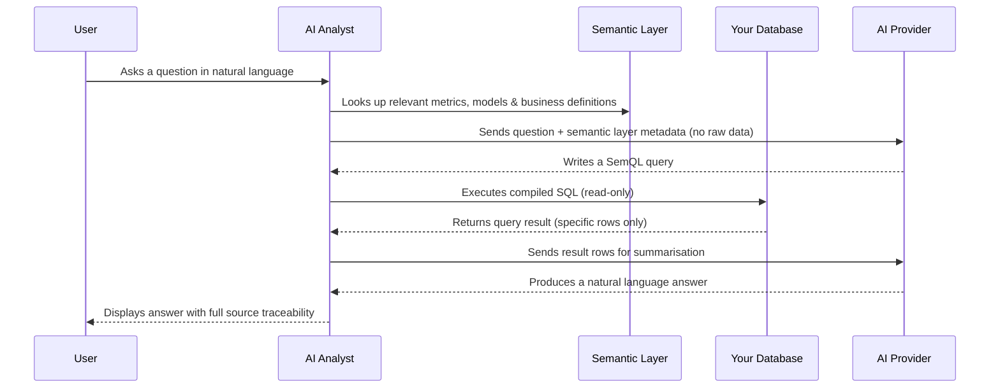
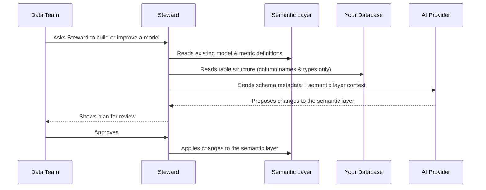

# How AI Analyst handles your data

This page explains exactly what happens to your data when you use AI Analyst — from the moment a user asks a question to the answer that appears on screen. It is written for IT, security, and governance teams evaluating the platform.

!!! info

    **In short:** AI Analyst reads from your database using encrypted, read-only connections. Your data is never copied to our systems. Nothing is ever used to train AI models.

***

## Core guarantees

**🔒 Encrypted connections** — All communication between AI Analyst and your data source uses TLS encryption in transit. Data at rest is encrypted using AES.

**📋 ISO 27001:2022 certified** — Our infrastructure and processes meet the requirements of the ISO 27001:2022 information security standard.

**👁️ Read-only access** — AI Analyst only ever reads from your data source. It cannot write, update, or delete any records.

**🚫 No data is copied** — Your data stays in your own database. We only retrieve the specific rows needed to answer a question, and those results are not persisted on our end.

**🤖 Not used for AI training** — Your data, your questions, and your results are never used to train or fine-tune any AI model.

***

## How your questions are answered

When a user asks a question, AI Analyst does not send your data to an AI provider and ask it to search through everything. Instead, it follows a precise, traceable process grounded in your semantic layer.

**What this means in practice:**

1. The AI provider never has direct access to your database
2. Your database credentials never leave your infrastructure
3. The AI provider only receives: the user's question, the relevant business definitions from your semantic layer (metric names, descriptions, relationships), and the specific rows returned by the query
4. All queries are compiled from SemQL — a structured semantic query language — and executed read-only against your data source

***

## How Steward works with your data

Steward is the AI agent that helps data teams build and maintain the semantic layer. It has a slightly different interaction with your data than the analyst agents.

**What Steward accesses:**

- The *structure* of your tables — column names, data types, and relationships — to understand what can be modelled
- Your existing semantic layer definitions, to ensure new suggestions are consistent

**What Steward does not access:**

- The actual rows of data in your tables
- Any personally identifiable information or business records

!!! info

    When Steward inspects a table to suggest models, it reads column names and types — not the data inside the rows. Your actual business data is never sent to an AI provider during this process.

***

## What is stored and where

All data stored by AI Analyst lives in a PostgreSQL database hosted on Google Cloud Platform in the **European Union**.

**What we store:**

- Conversation history — the questions users ask and the answers AI Analyst provides
- Your semantic layer — model definitions, metrics, dimensions, business logic, and glossary terms
- AI Analyst configuration — instructions, access settings, saved prompts
- Audit logs — a record of who did what and when, for your compliance needs

**What we do not store:**

- Copies of your database, tables, or their contents
- Query results after a session ends
- Any raw data from your connected data sources

**Traces for debugging:**

We store anonymised traces of AI interactions in a secure logging service. These traces capture metadata about how the AI reasoned through a question — for example, which tools were called and whether the query succeeded — and are used solely by our engineering team to diagnose issues and improve reliability. Traces are never used to train or fine-tune any AI model, and are subject to the same data processing agreements as the rest of the platform.

***

## AI providers

AI Analyst uses large language models from leading AI providers — including Microsoft Azure, Anthropic, and Google Cloud — to process questions and generate answers. The provider used at any given time depends on the nature of the task.

All providers operate under standard data processing agreements. None of them use your data for model training.

***

## Summary

| | AI Analyst agents | Steward |
|---|---|---|
| Accesses your database | ✅ Read-only queries | ✅ Table structure only |
| Sends data to AI provider | Query results (specific rows) | Column names & types only |
| Stores your data | ❌ Never | ❌ Never |
| Used for AI training | ❌ Never | ❌ Never |

***

For information about our broader security posture, certifications, and contractual commitments, see [How Actian AI Analyst protects your data](how-wobby-protects-your-data.md).

For a full record of actions taken in your workspace, see [Audit Logs](audit-logs.md).
