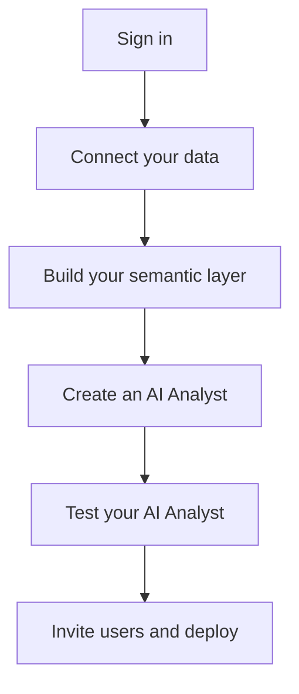

# Getting started as an Admin

Studio is where data teams build and configure AI Analysts. This guide walks you through setting up your first AI Analyst from scratch.

### Setup flow

## Step 1: Sign in

Go to [wobby.ai](https://www.wobby.ai/) and sign in with your account. If you don't have one yet, click _Get started for free_ to create an organisation.

## Step 2: Connect your data

AI Analysts need access to your data before they can answer questions.

1. In Studio, open **Connections** in the left sidebar
2. Click **Add connection** and select your data source (PostgreSQL, Snowflake, BigQuery, etc.)
3. Enter your connection credentials and save

See [Connect a data source](../connections/connect-a-data-source/) for detailed instructions per database type.

## Step 3: Build your semantic layer

The semantic layer is what keeps your AI Analyst accurate — it maps your raw tables and columns to business concepts your team actually uses.

1. Go to **Semantic Layer** in the sidebar
2. Create your first **Model** by selecting a table from your connected data source
3. Add **Dimensions** (descriptive attributes like `region` or `customer_tier`) and **Measures** (numeric calculations like `total_revenue`)
4. Optionally add **Metrics** for your most important KPIs

See [Models](../semantic-layer/models/) and [Metrics](../semantic-layer/metrics.md) to go deeper.

## Step 4: Create an AI Analyst

1. Go to **AI Analysts** in the sidebar and click **New AI Analyst**
2. Give it a name and description that reflects its purpose (e.g. "Sales Performance Analyst")
3. Under **Models**, link the models you built in Step 3
4. Under **Instructions**, write a brief description of what the AI Analyst should focus on and how it should behave

See [Instructions](../agent/creating-an-agent/agent-instructions.md) for guidance on writing effective instructions.

## Step 5: Test your AI Analyst

Open your AI Analyst and switch to Explorer view to test it. Ask a few questions that you'd expect a real user to ask. If results are off, go back to your semantic layer and refine your models, dimensions, or measures.

## Step 6: Invite users and deploy

1. Under **Access Management**, invite users or share the AI Analyst with your team
2. Optionally connect to [Slack](../connections/messaging-apps/slack.md) or [Microsoft Teams](../connections/messaging-apps/teams.md) so users can query data directly from those tools

***

_Next:_ explore [Suggestions](../ai-analysts/creating-an-agent/suggestions.md) and [Saved Prompts](../agent/working-with-agents/saved-prompts.md) to give your users a great first experience.
