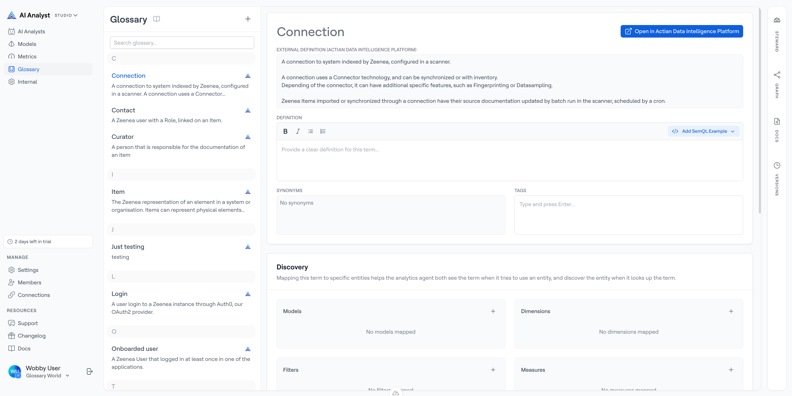

# Glossary

The glossary solves a fundamental problem: people don't talk like database schemas.

Your sales team talks about "quotes", but your database calls them "contracts with status='quoted'". Your executives ask about "active customers", but your schema has multiple flags and date fields that define "active". The glossary bridges this gap by mapping business terminology to your semantic layer.

## Why Use a Glossary?

### Natural Language Understanding
When someone asks "How many quotes did we make this year?", agents need to know that "quotes" maps to specific filters, measures, or models in your semantic layer.

Without a glossary, agents must guess what "quotes" means. With a glossary, they know exactly which components to use.

### Consistency
Everyone uses the same definition. When your sales team, marketing team, and executives all ask about "active customers", they get the same answer because the glossary defines it once.

### Discoverability
Users can ask questions using the terms they know, without needing to understand your data schema or semantic layer structure.

## Creating a Glossary Term

When you add a term to your glossary, you'll configure several components:

### Term Name

The business word or phrase you want to define.

**Examples**: `Active Customer`, `Quote`, `Premium User`, `Transaction`, `Order Status`

Use terms that match how your team naturally talks about your business.

### Definition

A clear, complete explanation of what this term means in your business context.

**Example**: "A customer with at least one transaction in the last 90 days and an active subscription status."

Write definitions that someone unfamiliar with your business could understand. Explain edge cases and important distinctions.

### Synonyms

Alternative words or phrases people might use for this term. This helps agents understand questions phrased different ways.

**Example**: For the term "Active Customer", you might add synonyms:

- Current Customer
- Engaged Customer
- Active Account

When someone asks about "current customers", agents will know to use the "Active Customer" glossary term and its mappings.

To add synonyms, type them in the field and press Enter. You can add multiple synonyms for each term.

### Tags

Organizational labels that help categorize your glossary terms. These are optional but helpful for managing large glossaries.

**Example tags**: `core-concept`, `user-types`, `metrics`, `time-periods`

Tags appear in the UI and help users browse related terms.

## Mappings: Connecting Terms to Your Data

The most powerful part of the glossary is mappings—connecting business terms to specific semantic layer components. This is how agents know what to query when someone uses a glossary term.

### Models Mapping

Connect this term to one or more models in your semantic layer.

**Example**: The term "Active Customer" might map to the `customers` model, since active customers are represented in that model.

When you map a term to a model, you provide a description explaining the connection: "Customers with recent activity and valid subscription status"

### Dimensions Mapping

Connect this term to specific dimensions that represent or describe this concept.

**Example**: The term "Active Customer" might map to:

- `customer_tier` dimension - "Customer tier - either 'premium', 'standard', or 'basic'"

When someone asks "Show me active customers by tier", agents know to use the `customer_tier` dimension.

### Filters Mapping

Connect this term to pre-defined filters that subset data to this concept.

**Example**: The term "Active Customer" might map to:

- `active_customers_only` - "Filter to include only customers with recent activity"
- `premium_customers_only` - "Filter to include only premium tier customers"

When someone asks "Show me just active customers", agents know to apply the `active_customers_only` filter.

### Measures Mapping

Connect this term to measures that count, sum, or aggregate this concept.

**Example**: The term "Active Customer" might map to:

- `total_customers` - "Total count of customers"
- `total_active_customers` - "Count of active customers only"
- `total_premium_customers` - "Count of premium tier customers only"

When someone asks "How many active customers do we have?", agents know to use the `total_active_customers` measure.

### Metrics Mapping

Connect this term to metrics that calculate business KPIs related to this concept.

**Example**: Customer-related terms might map to metrics like `monthly_active_customers`, `customer_retention_rate`, or `average_revenue_per_customer`.

When someone asks "What's our weekly active user count?", agents use the mapped metric.

## How Agents Use the Glossary

When a user asks a question, agents:

1. **Identify business terms** in the question
2. **Look up those terms** in the glossary
3. **Use the mappings** to find relevant models, dimensions, filters, measures, or metrics
4. **Construct the query** using those components

**Example Flow**:

- User asks: "How many customers placed orders last week?"
- Agent finds "customers" in glossary → mapped to `customers` model and `total_customers` measure
- Agent finds "orders" in glossary → mapped to `orders` model
- Agent finds "last week" → uses time dimension with week grain
- Agent constructs query combining these components

## Alphabetical Organization

The glossary displays terms alphabetically in the UI, grouped by first letter (A, B, C, etc.). This makes it easy to browse and find terms.

Each term shows:

- The term name
- A brief preview of the definition
- A count of mappings (shown as a number badge)

## Best Practices

**Define commonly used terms first**: Start with the words your team uses most frequently in questions.

**Include variations**: Add synonyms for how different departments might refer to the same concept.

**Write clear definitions**: Assume the reader doesn't know your business. Explain edge cases and important distinctions.

**Map comprehensively**: Connect each term to all relevant models, dimensions, filters, measures, and metrics. The more mappings, the better agents can answer questions.

**Update regularly**: As your business evolves and your semantic layer grows, keep your glossary current.

**Use descriptions in mappings**: When you map a term to a component, always include a description explaining the connection. This helps both agents and your team understand the relationship.

## Syncing Terms from the Actian Data Intelligence Platform

If your organization uses the Actian Data Intelligence Platform as your enterprise data catalog, you can connect it to Actian AI Analyst and automatically sync governed business terminology directly into your Glossary — no manual entry required.

### How synced terms work

Once a [catalog connection](../connections/catalog/actian-data-intelligence-platform.md) is set up and a sync runs, terms from the catalog appear in your Glossary alongside any manually created terms. They behave identically for AI Analysts: agents look up terms, find their definitions, and use them to answer questions.

Synced terms include:

- **Name and definition** — pulled directly from the catalog
- **Synonyms** — alternative names defined in the catalog
- **Hierarchy** — parent/child relationships between terms (e.g. "Revenue" is a parent of "Net Revenue")
- **Source link** — a link back to the original item in the Actian Data Intelligence Platform

### Identifying synced terms

Synced terms display a source indicator showing they originate from the Actian Data Intelligence Platform. You can tell a term is synced (rather than manually created) by this indicator.

### Removed terms

If a term is removed from the catalog and the connection is set to **Retain** removed items, the term remains in your Glossary but is marked as removed. Removed terms are visible to data teams for review but are *not* used by AI Analysts when answering questions.

To change how removed terms are handled, see [Removed Items Behavior](../connections/catalog/actian-data-intelligence-platform.md#handling-removed-terms).

### Editing synced terms

Synced terms can have manual [mappings](#mappings-connecting-terms-to-your-data) added to them (connecting them to models, measures, filters, etc.), just like manually created terms. This lets you enrich catalog-sourced terminology with query-specific context.

!!! info

    The term's name and definition are managed by the catalog. To change them, update the source in the Actian Data Intelligence Platform — the changes will be reflected in the next sync.

## Glossary vs Semantic Layer Components

**Glossary** = Business vocabulary and how it maps to your data
**Models, Metrics, Measures** = Technical structure of your data

The glossary is the bridge between how people talk and how data is organized. Without it, agents must guess. With it, they can confidently translate questions into queries.
