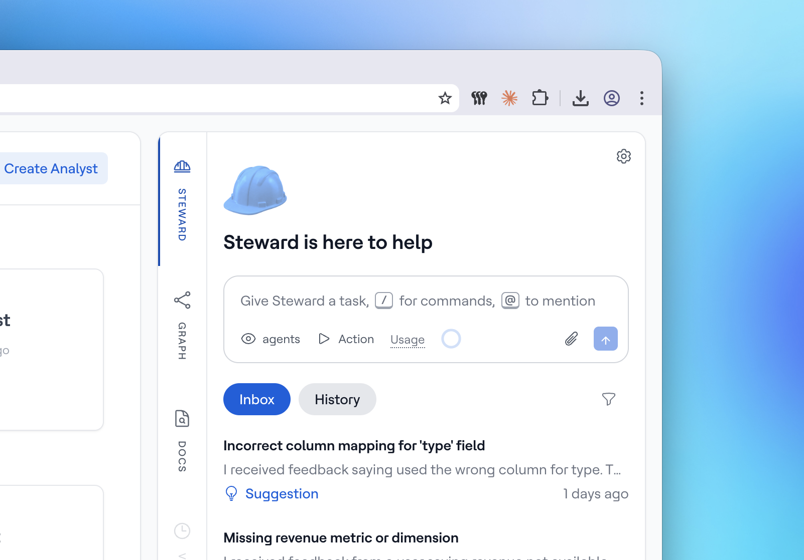

# Steward Inbox

The Steward Inbox is where Steward surfaces issues and improvements it discovers in your semantic layer. Like application monitoring tracks uptime and errors, Steward continuously monitors the health of your semantic layer by analyzing your AI Analyst conversations — so you don't have to review them manually.

Steward is proactive: instead of waiting for you to find problems, it comes to you with what it found and a plan to fix it.

<figure><figcaption></figcaption></figure>

## How It Works

Periodically, Steward scans your semantic layer and reviews what your AI Analysts have been working through. It looks at where analysts struggled, what users asked about, and how well your semantic layer is serving the questions being asked. When it finds something worth addressing, it creates an inbox item with context and a proposed plan.

Items fall into three categories:

* **Alerts** — critical issues that are actively breaking things or causing incorrect results
* **Suggestions** — actionable improvements with a clear next step
* **Insights** — observed patterns worth knowing about, even if there's no single fix

Items that go untouched expire after a period of time and are removed from your inbox automatically.

## What Steward Will Surface

### Alerts

Alerts are raised when something is broken or likely to produce wrong results. Examples:

* A column referenced in a model or metric no longer exists in your warehouse — queries are failing or silently returning incorrect data
* A model's underlying table was renamed or moved, causing the analyst to error out
* A metric's definition references a measure that has been deleted

### Suggestions

Suggestions are improvements Steward recommends based on patterns it observed. Examples:

* Analysts keep manually calculating a value (like "revenue per customer") that would work better as a defined metric — Steward suggests adding it
* Users frequently ask about a dimension (like customer segment or contract type) that isn't modeled yet — Steward suggests adding it
* A relationship between two models (like orders and customers) isn't defined, forcing analysts to work around it — Steward suggests adding the relationship
* A measure or dimension has a vague or missing description, causing the analyst to misinterpret it — Steward suggests improving the description

### Insights

Insights highlight patterns that may not need an immediate fix but are worth knowing about. Examples:

* Multiple users are repeatedly asking about a topic your semantic layer doesn't cover yet — useful for prioritizing what to model next
* Analysts are consistently producing different answers for what seems like the same question, suggesting an ambiguous or inconsistently defined concept

## What Won't Be Surfaced

Steward focuses on what your data team can actually fix. It won't raise items for:

* **Upstream data quality issues** — nulls, missing values, or incorrect records in your source warehouse are out of scope
* **Access and permission issues** — if a user can't see certain data due to database permissions, that's not a semantic layer problem
* **Questions outside your data** — if users ask about topics your warehouse simply doesn't contain, that's expected behavior, not a gap to fix

## Working with Inbox Items

Each inbox item has a title, a description of what Steward found, and a proposed plan — a summary of the steps Steward will take to address it.

You can **approve the plan** to let Steward execute it right away, or **reply to discuss it** first. If you want Steward to adjust its approach, just tell it what to change — Steward updates the plan and presents it for your approval before executing.

If an item isn't relevant, dismiss it. Steward will ask for a reason: already fixed, not relevant, incorrect, or other. These reasons help Steward improve its future suggestions.
